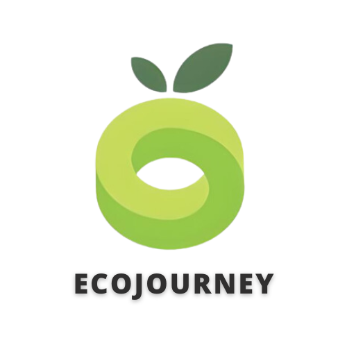

# Capstone Bangkit Academy C241-PS055

## Introduction
*EcoJourney* aims to tackle environmental challenges in Indonesia by promoting community awareness and providing education on proper waste management. By leveraging machine learning, mobile development, and cloud computing, the project addresses the urgent need for sustainable practices to combat climate change. The initiative focuses on reducing waste pollution and empowering individuals to actively participate in environmental stewardship.

## Team Members
C241-PS055 is a group of people consisting of the best civilians on earth. We are an cohorts from Bangkit Academy. C241-PS055 consists of 7 members :

 
<table>
    <tr>
        <td colspan=3 align="center" style="font-weight:bold">Kelompok C241-PS055</td>
    </tr>
    <tr>
        <td>No.</td>
        <td>Name</td>
        <td>Student ID</td>
        <td>University</td>
    </tr>
    <tr>
        <td>1.</td>
        <td>Muhammad Irsyad Fikri Azhar</td>
        <td>M288D4KY1929</td>
        <td>Universitas Pamulang</td>
    </tr>
    <tr>
        <td>2.</td>
        <td>Ahmad Rizki</td>
        <td>M002D4KY2991</td>
        <td>Institut Teknologi Bandung</td>
    </tr>
    <tr>
        <td>3.</td>
        <td>Audrey Naila Putri</td>
        <td>M117D4KX2077</td>
        <td>Institut Teknologi Nasional Bandung</td>
    </tr>
    <tr>
        <td>4.</td>
        <td>Abdillah Assajjad</td>
        <td>C010D4KY0920</td>
        <td>Universitas Indonesia</td>
    </tr>
    <tr>
        <td>5.</td>
        <td>Raden Dizi Assyafadi Putra</td>
        <td>C002D4KY1028</td>
        <td>Institut Teknologi Bandung</td>
    </tr>
    <tr>
        <td>6.</td>
        <td>Fikri Naufal Hamdi</td>
        <td>A002D4KY3518</td>
        <td>Institut Teknologi Bandung</td>
    </tr>
    <tr>
        <td>7.</td>
        <td>Fadlan Ariel Fathurrahman</td>
        <td>A010D4KY4491</td>
        <td>Universitas Indonesia</td>
    </tr>
</table>

Together, we are eager to make impactful changes in the world.

## Project Scope & Deliverables:
### Project Goal:
- Build a mobile application (Android) that can classify waste type and give article or news recommendation based on classified waste type.
### Deliverables:
- Application Prototype
- Waste Recognition ML Model
- API Endpoint and Documentation
- Mobile Application
- Product Requirement Document
- Project Documentation Document
- Final Product

### Scope:
- Article and News Recommendation
- Waste Recognition Model
- Login and Register with Personalized User Survey UI
- Waste Scan History UI
- User Profile UI
- Login and Register Endpoint
- Waste History Endpoint
- Waste Recognition ML Pipeline
- Article and News Endpoint

## Repositories
- [RashIO-API](https://github.com/EcoJourney-Bangkit-Capstone/EcoJourney-backend)
- [RashIO-Machine Learning](https://github.com/EcoJourney-Bangkit-Capstone/EcoJourney-ML)
- [RashIO-Mobile Development]( https://github.com/EcoJourney-Bangkit-Capstone/EcoJourney-Mobile)

---

<h3 align="center">
     
    Author
     
</h3>

    Capstone Project 
    C241-PS055 
    Bangkit Academy 2024

